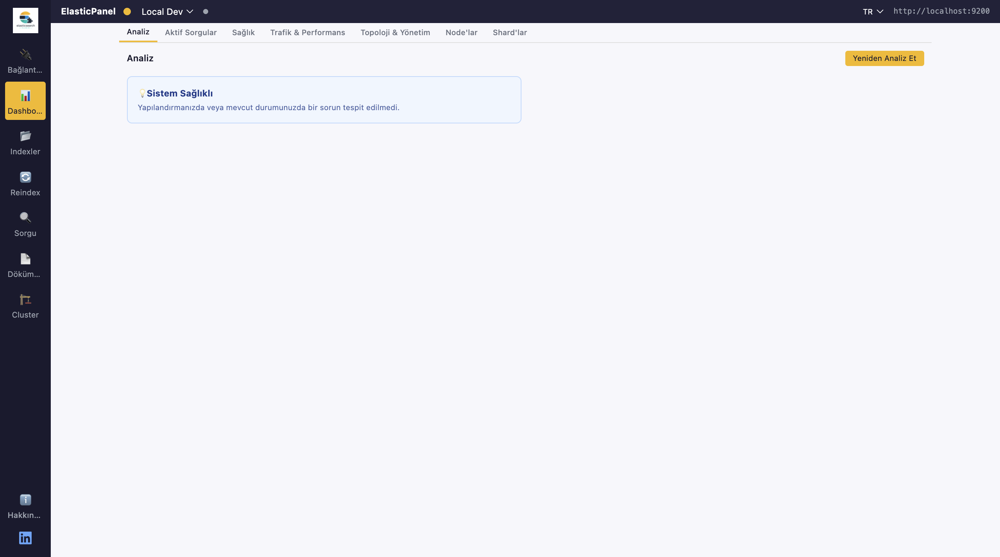
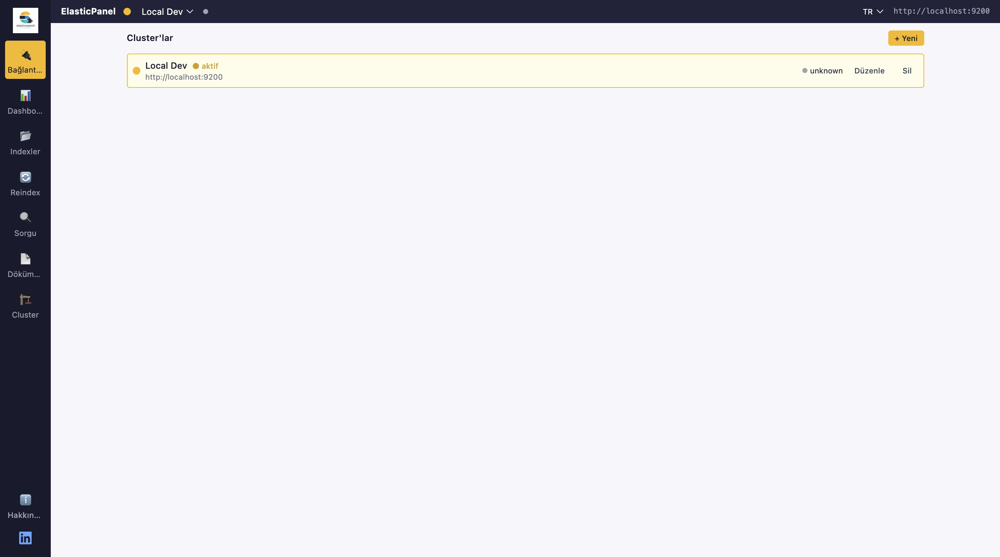
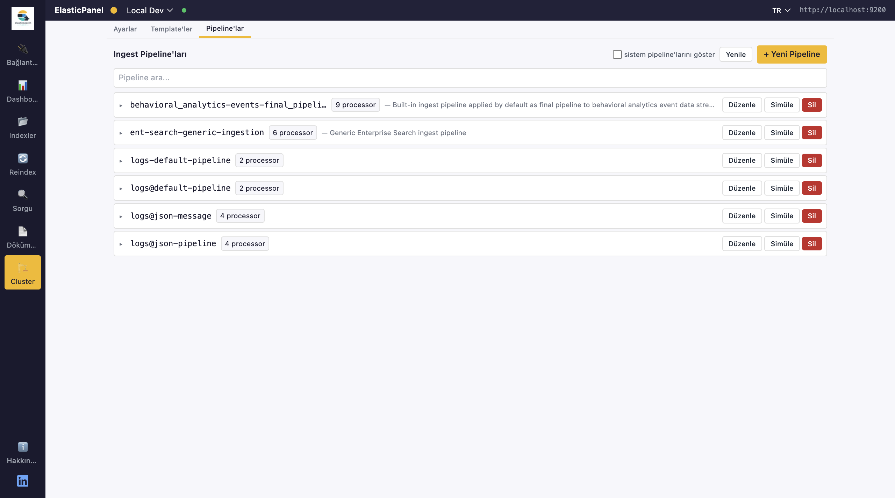
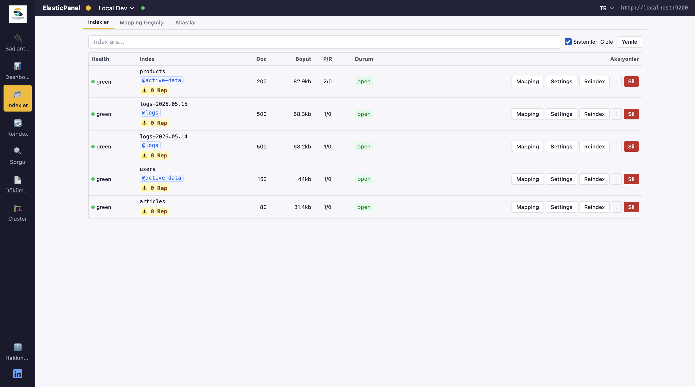
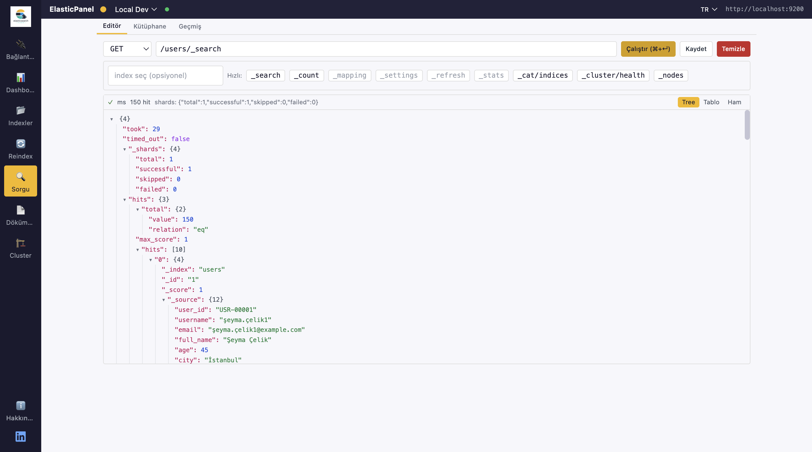
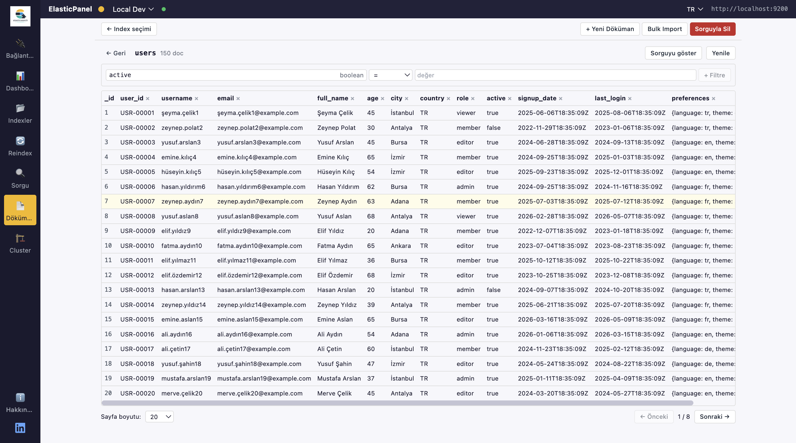
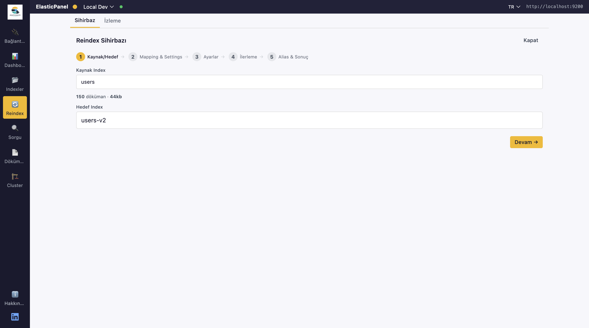

# ElasticPanel

### Manage your Elasticsearch clusters directly from Chrome.

A modern, fast and lightweight Chrome extension for developers, DevOps engineers and data engineers who work with Elasticsearch every day. No more switching to Kibana or terminal — query, monitor and manage your clusters from a side panel.

[Install from Chrome Web Store](#) · [Privacy Policy](./PRIVACY.md)

---

## Features

### Multi-cluster connection management
Save unlimited Elasticsearch endpoints with Basic Auth or API Key. Switch between dev, staging and production clusters with one click. All credentials stay in your browser — never sent anywhere else.

### Real-time cluster monitoring
Watch cluster health, node status, shard distribution and live performance metrics. Inspect every node and shard without leaving the panel.

### Index management
List, create, delete indices. View and edit settings and mappings. Filter by name, status or document count.

### Powerful query editor
A full CodeMirror editor with JSON syntax highlighting, validation and Elasticsearch DSL autocomplete. Run queries against any saved cluster and inspect results instantly.

### Document CRUD
Search, create, update and delete documents through a clean UI. No need to remember REST endpoints — point, click, edit.

### Reindex & Alias operations
Start reindex tasks between indices, manage aliases, monitor running tasks. All from one screen.

### Three viewing modes
- **Popup** — quick checks from the toolbar
- **Side Panel** — keep ElasticPanel open next to your work
- **Standalone** — full-page mode in a dedicated tab

### Multi-language
Turkish, English and Arabic UI out of the box. Auto-detects browser language.

---

## Installation

### From Chrome Web Store (recommended)
*Coming soon — pending review.*

### Manual installation (developer mode)
1. Clone this repo and use the `extension/` folder directly.
2. Open `chrome://extensions` in Chrome.
3. Enable **Developer mode** (top right).
4. Click **Load unpacked** → select the `extension/` folder.
5. Pin ElasticPanel to your toolbar and click the icon to open.

---

## Privacy & Security

ElasticPanel **does not collect, transmit or share any user data**. Everything stays on your device:

- Cluster credentials are stored locally via `chrome.storage.local`.
- HTTP requests are sent **only** to the Elasticsearch endpoints you manually add.
- No analytics, no telemetry, no third-party scripts.
- No remote code execution — all logic is bundled inside the extension.

Read the full [Privacy Policy](./PRIVACY.md).

---

## Permissions explained

| Permission | Why it's needed |
| --- | --- |
| `storage` | Save your cluster connections and language/theme preferences locally. |
| `sidePanel` | Run ElasticPanel inside Chrome's native side panel. |
| `tabs` | Open the standalone mode in a new tab and route popup/side panel correctly. |
| `activeTab` | Open the UI in the context of the currently focused tab. |
| `host_permissions: <all_urls>` | Send HTTP requests to whichever Elasticsearch endpoint you add — internal IPs, private domains, localhost — the host can't be predicted in advance. **No site content is read.** |

---

## Tech stack

- React 18 + TypeScript
- Vite + `@crxjs/vite-plugin`
- Tailwind CSS
- CodeMirror 6 (query editor)
- i18next (TR / EN / AR)
- Chrome Extensions Manifest V3

---

## Roadmap

- [ ] Ingest pipeline management
- [ ] Snapshot & restore UI
- [ ] Query history & saved queries
- [ ] Dark / Light theme toggle
- [ ] Cluster comparison view

Have an idea or found a bug? Open an issue.

---

## Contact

- **Developer:** Gökhan Güneş
- **Email:** gokhangunes.4@gmail.com

---

## License

[MIT](./LICENSE) © Gökhan Güneş
